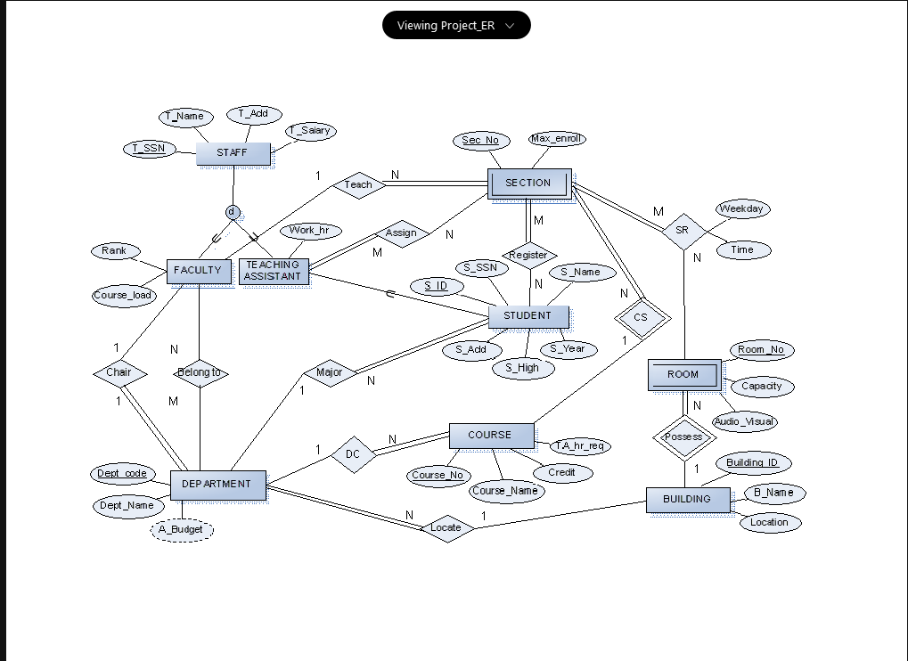

# CS631-Final-Project

Project scope:

- To develope a comprehensive registration database system using `Django` and `MySQL`.
- Demonstrate practical understanding of `C`, `SQL`, data structures, and relational databases.

Directories:

- `Registration`: A module that handles all aspects related to user registration, demonstrating the application of relational database technology.
- `Templates`: This directory contains the Django HTML templates used to create the front-end interface of the system.
- `Manage.py`: The Django command-line utility that lets you interact with this Django project in various ways.
- `Table_create.sql`: An SQL script that establishes the database schema, illustrating my proficiency in SQL and database design.

---

